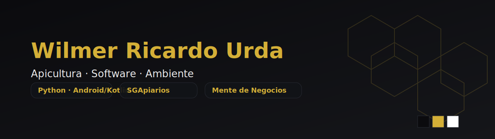

<!-- Profile README - Wilmer Ricardo Urda (Wilnecot) -->

  

<h1 align="center">Hola, soy Wilmer Ricardo Urda 👋</h1>

  Tecnólogo en Control Ambiental · Est. Ing. Agroforestal · Desarrollador (Python · Android/Kotlin) · Apicultor

  
  
  

---

## 🚀 Proyectos destacados

- **Sistema de Gestión de Apiarios (SGApiarios / ApiMarket)**  
  Gestión de colmenas, cosechas, sanidad, trazabilidad y ventas. Roadmap: app Android (Kotlin + Firebase), API, panel web.  
  Repos: *(añade los que correspondan)*
  - `GA7-220501096-AA5-EV01-Construcción-de-API` → *(API de autenticación / Java Servlets)*  
    https://github.com/Wilnecot/GA7-220501096-AA5-EV01-Construcci-n-de-API

- **Mente de Negocios (YouTube automatizado)**  
  Canal de finanzas y negocios con generación de guiones en Python y TTS. *(Agrega el enlace real de tu canal)*

- **WilmerFly (Fotografía y drones)**  
  Fotogrametría con DJI Mini 3, paisajes y tomas aéreas. *(Agrega tu portafolio o IG/YouTube real)*

---

## 🧰 Stack & herramientas

**Lenguajes:** Python, Java, JavaScript, Kotlin, SQL  
**Frameworks/Librerías:** Android, FastAPI/Flask, React, Maven  
**Datos/IA:** Pandas, NumPy, Scikit‑learn, Matplotlib, Jupyter  
**DevOps:** Git/GitHub, CI/CD (GitHub Actions), Docker *(cuando aplique)*  
**SIG & Medio Ambiente:** QGIS, monitoreo de calidad de aire/ruido

---

## 📊 Ahora mismo estoy…

- Construyendo el **MVP móvil** de SGApiarios (Android + Firebase/Auth).  
- Afinando **prototipos funcionales y no funcionales** (usabilidad/accesibilidad).  
- Automatizando **guiones y vídeos** para *Mente de Negocios*.  
- Profundizando en **Python avanzado** y **Kotlin**.

---

## 🗂️ Cómo trabajo

- Diseño primero el **modelo de dominio** (UML, ER).  
- Defino **requisitos funcionales/no funcionales** y casos de uso.  
- Itero con **pruebas** (unitarias y de funcionalidad en despliegue).  
- Documentación limpia (APA 7 cuando aplica) y **versionado en Git**.

---

## 📈 Métricas & estado

  

---

## 📬 Contacto

- ✉️ Email: **(tu correo preferido)**  
- 💼 LinkedIn: **(tu URL real de LinkedIn)**  
- 🐝 ApiMarket / SGApiarios: **(URL o landing si ya la tienes)**  
- 🎥 YouTube — *Mente de Negocios*: **(enlace real)**  
- 🚁 WilmerFly: **(enlace real)**

> 💡 **Checklist antes de publicar**  
> 1) Cambia los campos de contacto por tus enlaces reales.  
> 2) Agrega más repos en “Proyectos destacados”.  
> 3) Sube el `banner.svg` junto al `README.md` para que se vea en la cabecera.

---

### 🎨 Paleta usada
- **Negro** `#0B0B0E` · **Dorado miel** `#D4AF37` · **Blanco** `#FFFFFF`

> Si prefieres PNG, puedes exportar el `banner.svg` desde Inkscape/Illustrator o usar una web de conversión.

